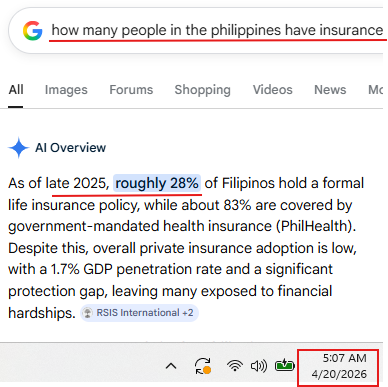
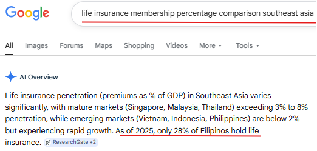

# Filipinos, no financial literacy, stopping them from getting insurance.

*Made the title with 3 brain cells left, while listening to Mxmtoon — dawn & dusk. Probably the dumbest.*

**TL;DR:** Insurance companies have been in the Philippines for decades and still can't crack the market — and their favorite explanation is that Filipinos "lack financial literacy." I've worked insurance campaigns in the BPO. I've heard the claims get denied. Filipinos aren't uninsured because they're uneducated; they're uninsured because they're broke, busy, carrying entire families, and — frankly — often right to be skeptical.

## How many Filipinos actually have insurance?

DUMB QUESTION: How many people in the Philippines have insurance?
*When I say dumb, it is dumb.* But here's what you get:

Insurance companies have been around in the Philippines for a long time; they exist, yes, but are unable to penetrate the market. For years, these companies have released multiple papers and graphs saying 9 out of 10 Filipinos have no insurance (whatever insurance that is) — then they compare the Philippines to the rest of Southeast Asia, put us at the bottom, and warn that we are not covered for the risks of an unforeseeable future.

Meanwhile, Americans pay for insurance — whatever insurance that is. Maybe health insurance, car, pet insurance, home insurance — averaging around $75 up to $300 a month. The Philippines is an untapped market (except car insurance), which is exactly why companies, especially foreign ones, want in so badly.

## What does insurance look like from inside the call center?

In my years of BPO experience, I've been on two insurance accounts: Home Warranty and Pet Insurance. Both run a monthly payment called a premium.

Home Warranty deals with home appliances — refrigerators, ovens, washing machines, dishwashers, and more — but mainly highlights air conditioning, heating, and plumbing. Here's how the dream works in practice:

A customer calls to have their A/C fixed — say there's a leak. The phone operator sends "the closest available technician." Sometimes the technician arrives within the day; around 90% of the time, no. So the operator gives you a 24-to-48-hour window for any tech to show up and have your A/C *maybe* fixed — sometimes with cheap parts that don't even work with your unit.

Now imagine paying that premium faithfully for five years, and the one time you finally submit a claim — denied.

That call doesn't show up in the industry's graphs. But the caller tells ten people about it, and all ten of them are future "financially illiterate" Filipinos who won't buy insurance.

## So why don't Filipinos buy insurance?

Not because they can't do math. Because the math doesn't fit the life:

- Filipinos will only think about a particular situation once it is current — the emergency gets budgeted when it arrives, not before.
- The Philippines has more breadwinners — multiple bills, plus parents and siblings to think about. There's no ₱2,000 lying around for a hypothetical.
- Most Filipinos prioritize other expenses — some necessary, some not — over saving for an emergency.
- Filipinos are more willing to just work harder — a part-time job, a second job — as their own safety net.
- And most commonly: they think it's a scam.

Look at that list again. Only one of those is about knowledge. The rest are about money, obligation, and trust.

## Is it really about financial literacy?

That's the industry's story, and it's a convenient one. Get this: insurance companies will say that Filipinos' skepticism of insurance is driven by a lack of financial education. Notice what that framing does — it puts the entire problem inside the customer's head, and none of it inside the product, the price, or the denied claims.

> A breadwinner choosing rice today over a payout tomorrow isn't financially illiterate. He's doing the math you refuse to show in your brochure.

The 28% who do have insurance? You're smart. And if you have one, you're most likely to convince a friend using a hypothetical: *"What if you die tomorrow?"*

My answer?

> *"Bury me in satin,
> lay me down on a bed of roses.
> Sink me in the river at dawn.
> Send me away with the words of a love song."*
