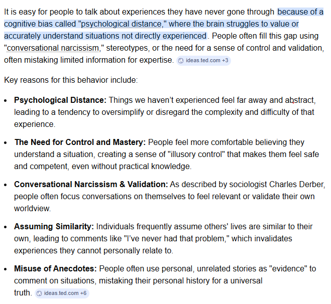

# Why is it so easy for people to say things about experiences they have never gone through?

**TL;DR:** "If I were you…" — the five most confident words in any language, usually spoken by someone who has never been you. Psychology has a name for why this comes so easily: psychological distance. The farther an experience is from your own here-and-now, the more abstract it becomes in your head — and abstract problems always look easy to solve. People aren't judging your life. They're judging a low-resolution sketch of it.

## Why does "If I were you" come so easily?

Because the person saying it is working with a summary, not an experience. If I were you, I would have left that job. If I were you, I would have saved money. If I were you — you what? You have never stood where I stand. You only *directly* experience one thing: your own here and now.

That's not me being defensive. That's the actual starting point of a well-studied idea in psychology called Construal-Level Theory.

## What is Construal-Level Theory?

It's a theory about how distance changes what things look like in your mind. From [the research](https://pmc.ncbi.nlm.nih.gov/articles/PMC3152826/):

> Psychological distance is egocentric: its reference point is the self in the here and now, and the different ways in which an object might be removed from that point — in time, in space, in social distance, and in hypotheticality — constitute different distance dimensions.

> People directly experience only the here and now. It is impossible to experience the past and the future, other places, other people, and alternatives to reality.

> Predictions, memories, and speculations are all mental constructions, distinct from direct experience.

In plain words: everything you haven't lived through yourself — someone else's poverty, someone else's grief, someone else's job — exists in your head only as a *construction*. A model. And here's the key finding: as psychological distance increases, construals become more abstract. The farther away something is from you, the blurrier and simpler your mental picture of it gets.

## What does distance do to our judgments?

It deletes the hard parts. Abstraction is compression — and what gets compressed out is exactly the stuff that makes an experience difficult:

- **The waiting.** From a distance, "find a better job" is one step. Up close, it's months of applications, rejections, and rent.
- **The constraints.** The advice-giver's model of your life doesn't include your sick parent, your loans, your three-hour commute.
- **The feelings.** Fear, exhaustion, and shame don't survive compression. That's why every hard decision looks calm from the outside.
- **The odds.** In a hypothetical, everything works out. Hypotheticality is literally one of the distance dimensions — the judge is living in the version of your life where the gamble paid off.

So when someone who's never missed a meal explains budgeting to the poor, or someone with no kids explains parenting, they aren't lying. They're honestly describing how easy the problem looks *at their distance*. The simplicity is real — it's just the simplicity of the sketch, not of the life.

> Distance makes philosophers out of spectators and cowards out of no one — because from far enough away, no decision is scary.

## Does this excuse it?

Understanding a bias isn't the same as surrendering to it. The theory explains the reflex; it doesn't make the reflex fair. A few honest rules I try to hold myself to:

- Before judging an experience I've never had, say the quiet part: *my picture of this is abstract.*
- Trade "If I were you, I would…" for "What was that actually like?" — one is a verdict, the other is a question.
- Remember it cuts both ways: people far from *my* life are judging a sketch of me, too. Their confidence is about their distance, not my choices.

Here and now — that's all any of us actually knows. Everything else deserves more humility than a hot take.
